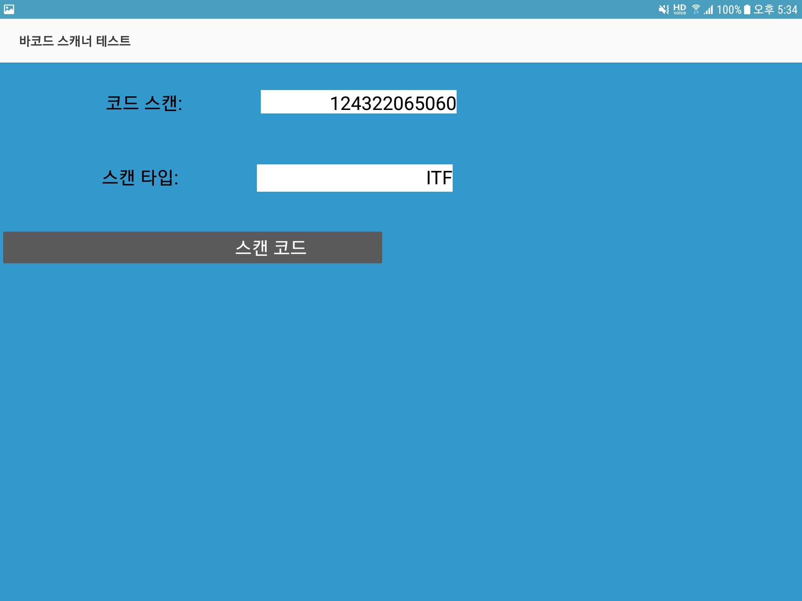
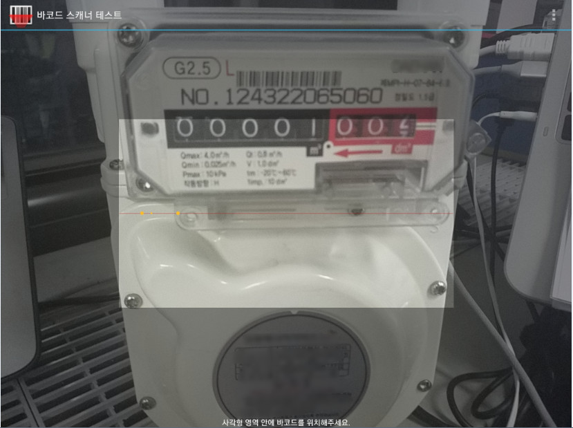
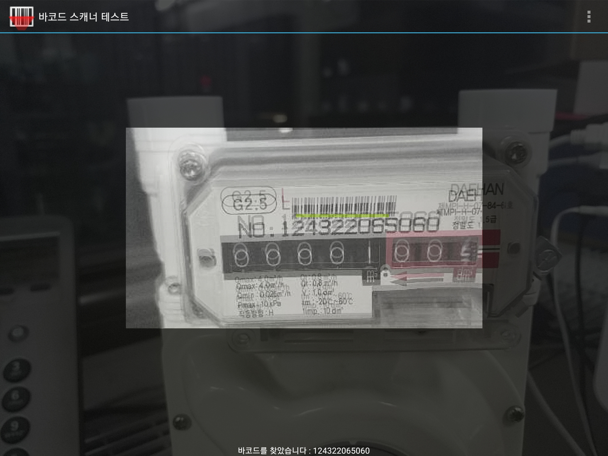

# zxing-mini
This is a simple program from the [zxing](https://github.com/zxing/zxing) which is an open-source, multi-format 1D/2D barcode image processing library implemented in Java.

I've modified it as a my personal curiosity.
The main acitivity is a BarCodeTester under the pagckage, com.google.zxing.client.android.mini.test.

I've tried to removed all supplimentary classes except the bar code reading part.

## Main Activity - BarCodeTester

## BarCode Activity: 
<!------> 

## BarCode Detected Screen: 
<!------> 

